# 🗺️ Fluxograma Completo - Conciliador Financeiro v2

> Visualização do fluxo de dados do início ao fim do sistema

**Autor**: Paulo Ygor - Estagiário | Grupo Doma
**Data**: 02/10/2025

---

## 📋 Como visualizar este fluxograma

### No VS Code:
1. Instale a extensão **Markdown Preview Mermaid Support**
   - ID: `bierner.markdown-mermaid`
2. Abra este arquivo
3. Pressione `Ctrl+Shift+V` (ou `Cmd+Shift+V` no Mac)
4. O diagrama será renderizado automaticamente

### Online (alternativa):
- Copie o código Mermaid e cole em: https://mermaid.live/

---

## 🌊 FLUXO PRINCIPAL: DO USUÁRIO AO RESULTADO

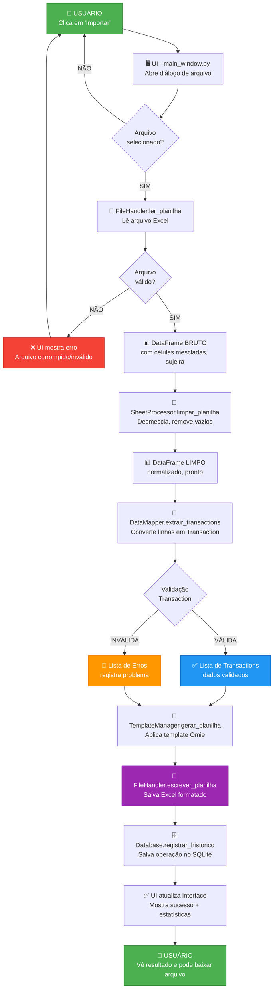

---

## 🏗️ ARQUITETURA EM CAMADAS

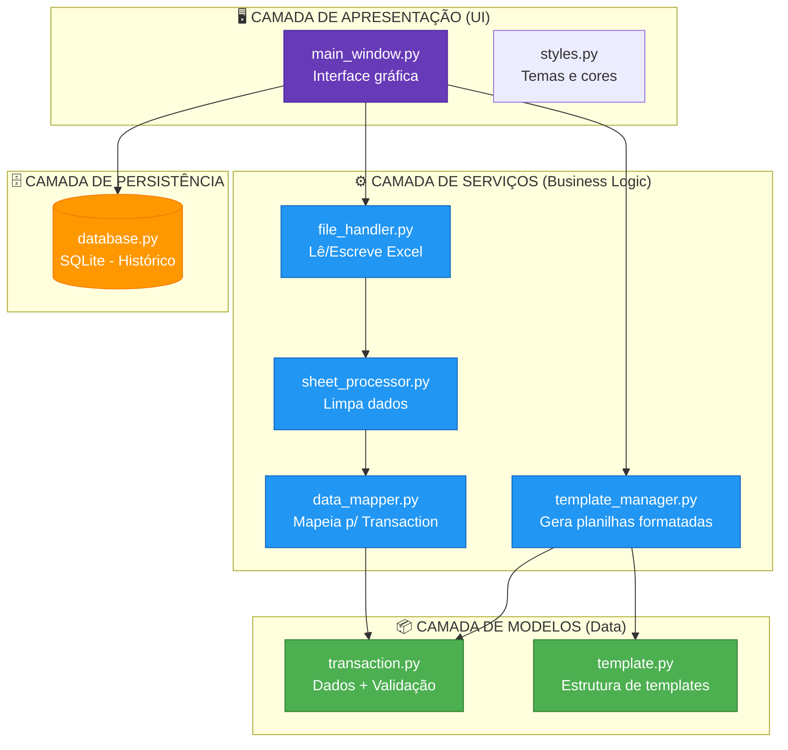

---

## 📂 FILEHANDLER: LEITURA DE ARQUIVO

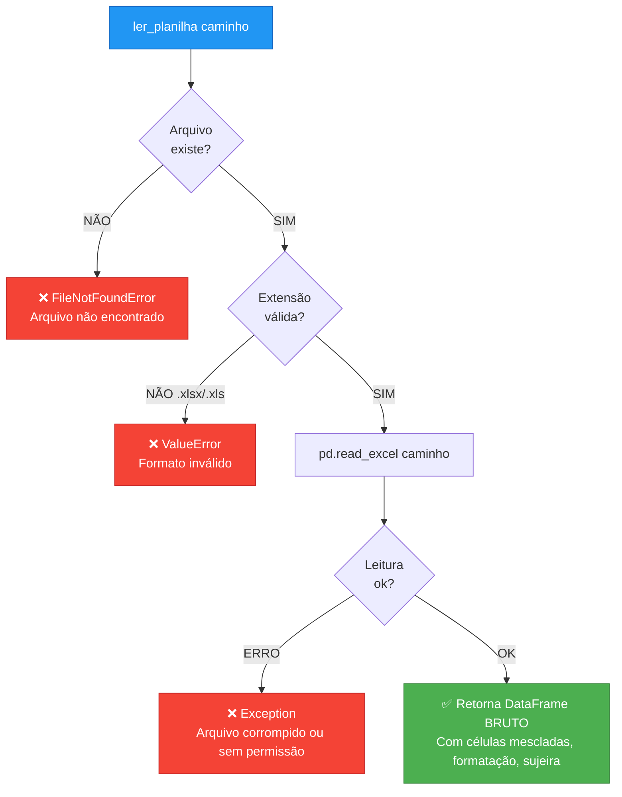

### 📝 Responsabilidade:
- ✅ Verificar se arquivo existe
- ✅ Validar extensão (.xlsx, .xls)
- ✅ Ler com pandas
- ✅ Tratar erros (arquivo corrompido, sem permissão)
- ❌ NÃO limpa dados (isso é SheetProcessor)
- ❌ NÃO valida conteúdo (isso é DataMapper)

---

## 🧹 SHEETPROCESSOR: LIMPEZA DE DADOS

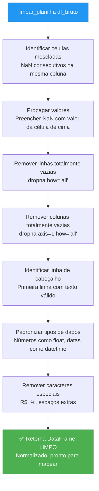

### 📝 Responsabilidade:
- ✅ Desmesclar células (propagar valores)
- ✅ Remover linhas/colunas vazias
- ✅ Identificar cabeçalho automaticamente
- ✅ Normalizar tipos (números, datas)
- ✅ Remover formatação decorativa
- ❌ NÃO valida regras de negócio (isso é Transaction)
- ❌ NÃO cria objetos (isso é DataMapper)

---

## 🔄 DATAMAPPER: CONVERSÃO PARA TRANSACTION

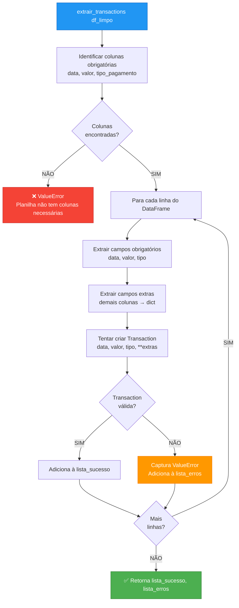

### 📝 Responsabilidade:
- ✅ Identificar colunas automaticamente
- ✅ Mapear linhas do DataFrame → Transaction
- ✅ Capturar erros de validação
- ✅ Retornar lista de sucessos + lista de erros
- ❌ NÃO valida dados (isso é Transaction)
- ❌ NÃO limpa planilha (isso é SheetProcessor)

---

## ✅ TRANSACTION: VALIDAÇÃO DE DADOS

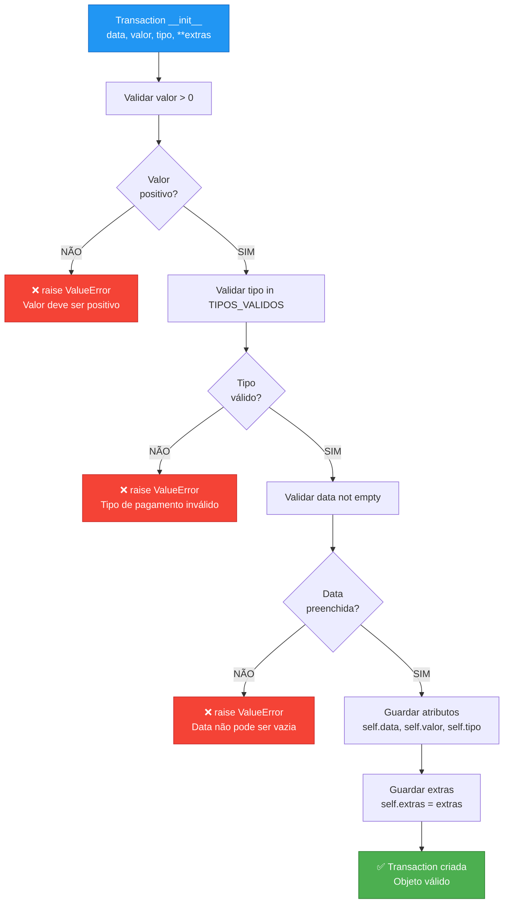

### 📝 Responsabilidade:
- ✅ Armazenar dados (data, valor, tipo, extras)
- ✅ Validar regras básicas (valor > 0, tipo válido)
- ✅ Disparar erro se inválido (raise ValueError)
- ✅ Serializar para dict (to_dict)
- ❌ NÃO lê planilhas (isso é FileHandler)
- ❌ NÃO processa dados (isso é SheetProcessor)
- ❌ NÃO busca dados (isso é DataMapper)

---

## 📑 TEMPLATEMANAGER: GERAÇÃO DE PLANILHA FORMATADA

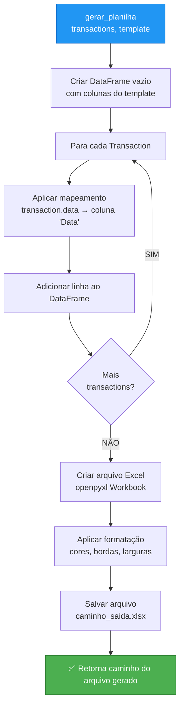

### 📝 Responsabilidade:
- ✅ Converter lista de Transaction → DataFrame
- ✅ Aplicar mapeamento do template
- ✅ Aplicar formatação (cores, bordas)
- ✅ Gerar arquivo Excel formatado
- ❌ NÃO valida dados (isso é Transaction)
- ❌ NÃO lê arquivos (isso é FileHandler)

---

## 🔀 FLUXO DE VALIDAÇÃO (DETALHE)

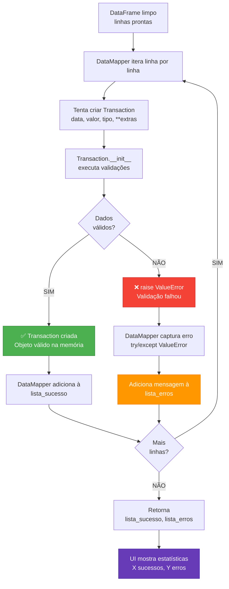

---

## 🎯 QUEM FAZ O QUÊ? (RESUMO)

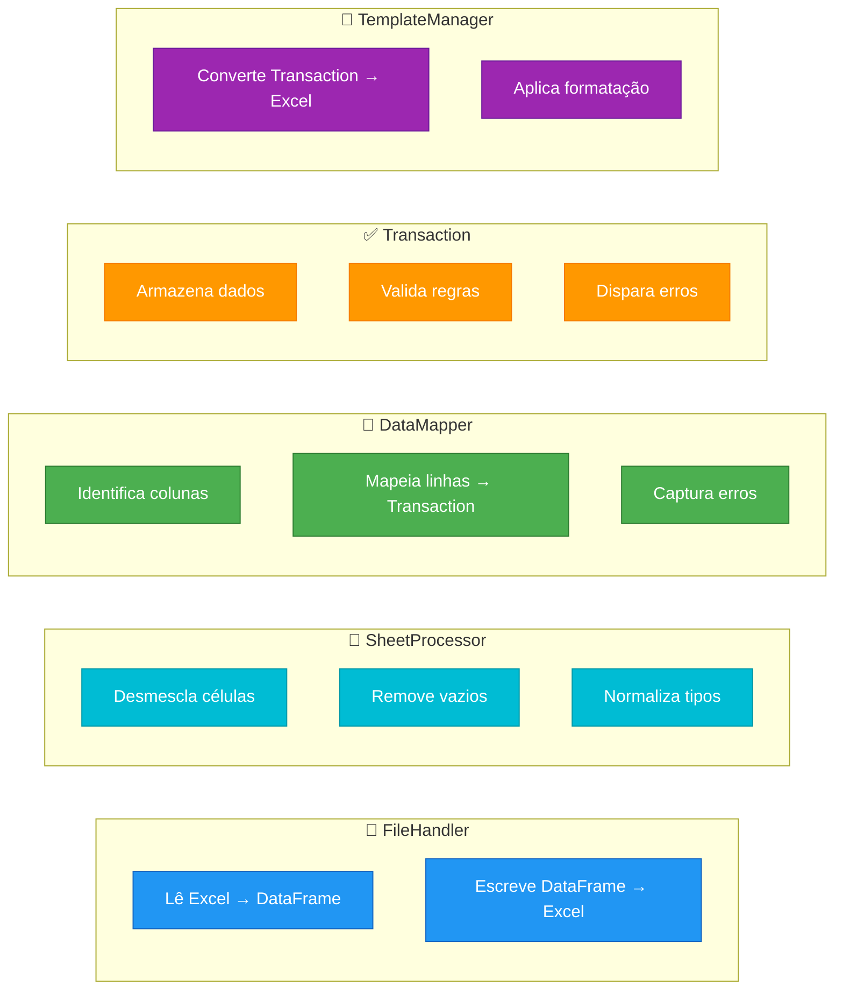

---

## 📊 EXEMPLO CONCRETO: PROCESSAR "vendas_outubro.xlsx"

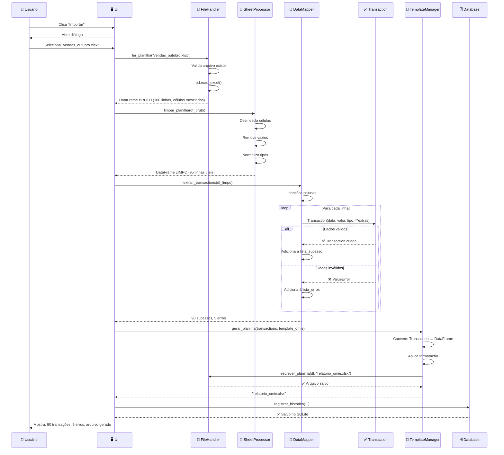

---

## 🧠 PRINCÍPIOS ARQUITETURAIS

### 1️⃣ Separação de Responsabilidades (SRP)

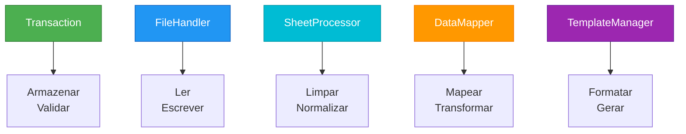

**Regra de ouro**: Cada módulo faz UMA coisa e faz BEM.

### 2️⃣ Bottom-Up (Menos → Mais Dependências)

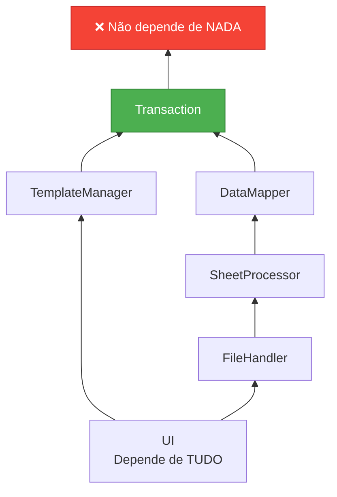

**Ordem de desenvolvimento**:
1. Transaction (zero dependências)
2. Template (zero dependências)
3. FileHandler → SheetProcessor → DataMapper (dependem de Transaction)
4. TemplateManager (depende de Transaction + Template)
5. UI (depende de tudo)

### 3️⃣ Classes "Burras" vs "Inteligentes"

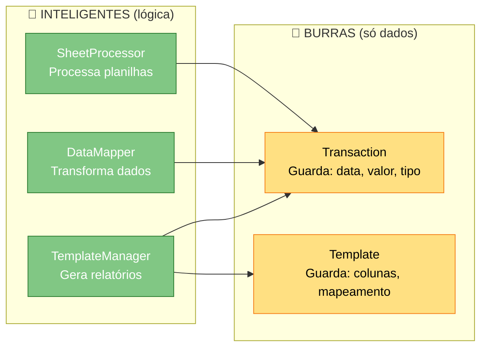

---

## ✅ CHECKLIST DE DESENVOLVIMENTO

### Fase 1: Models
- [x] Transaction.py (FEITO ✅)
- [ ] Template.py

### Fase 2: Services
- [ ] FileHandler.py ← **PRÓXIMO**
- [ ] SheetProcessor.py
- [ ] DataMapper.py
- [ ] TemplateManager.py

### Fase 3: UI
- [ ] main_window.py (integração)
- [ ] styles.py

### Fase 4: Persistência
- [ ] database.py

---

**Última atualização**: 02/10/2025
**Versão**: 2.0.0
